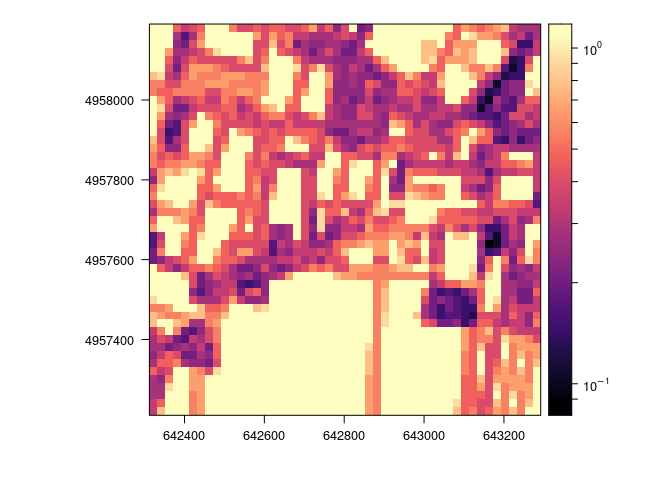

###VINDICTA progetto 16.1 PSR Emilia-Romagna 2014-2020 ##azione 3,
analisi agroecosistema ##Calcolo delle metriche di analisi
dell’agroecosistema

    library(raster)

    ## Caricamento del pacchetto richiesto: sp

    library(rasterVis)

    ## Caricamento del pacchetto richiesto: lattice

##Visualizzazione della resistenza

    setwd('./raster')
    resistance_norm <- raster('resistance_norm.tif')
    levelplot(resistance_norm,zscaleLog=TRUE,margin=F)

