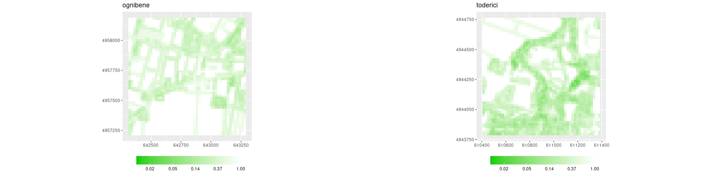
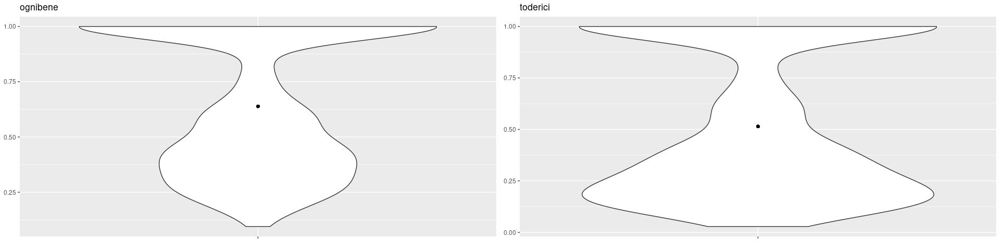

# VINDICTA progetto 16.1 PSR Emilia-Romagna 2014-2020

## azione 3, analisi agroecosistema

### Calcolo delle metriche di analisi dell'agroecosistema

### Visualizzazione della resistenza

<!-- -->

<!-- -->

